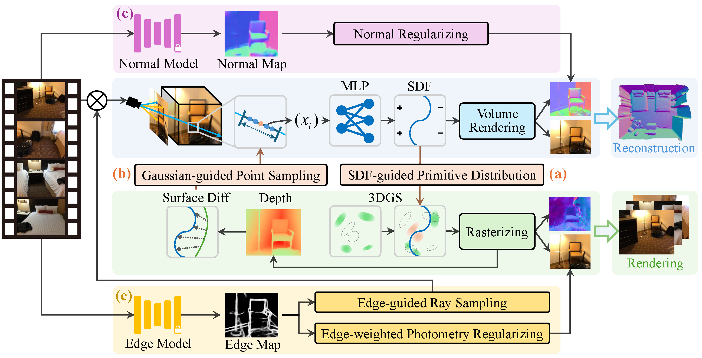

  <h1 align="center">GaussianRoom: Improving 3D Gaussian Splatting with SDF Guidance and Monocular Cues for Indoor Scene Reconstruction</h1>
<!--   <h2 align="center">ICML 2024</h2> -->
  

[Haodong Xiang*](xxx), [Xinghui Li*](xxx), [Xiansong Lai](xxx), [Wanting Zhang](xxx), [Zhichao Liao](xxx), [Kai Cheng](https://cklibra.github.io/)✉, [Xueping Liu](https://www.sigs.tsinghua.edu.cn/lxp/main.htm)✉  

### [[`Project Page`](https://xhd0612.github.io/GaussianRoom.github.io/)][[`arxiv`](https://arxiv.org/abs/2405.19671)][[`Paper`](https://arxiv.org/pdf/2405.19671)]

## 📃 Abstract
Recently, 3D Gaussian Splatting(3DGS) has revolutionized neural rendering with its high-quality rendering and real-time speed. However,  when it comes to indoor scenes with a significant number of textureless areas, 3DGS yields incomplete and noisy reconstruction results due to the poor initialization of the point cloud and under-constrained optimization. Inspired by the continuity of signed distance field (SDF), which naturally has advantages in modeling surfaces, we present a unified optimizing framework integrating neural SDF with 3DGS.This framework incorporates a learnable neural SDF field to guide the densification and pruning of Gaussians, enabling Gaussians to accurately model scenes even with poor initialized point clouds. At the same time, the geometry represented by Gaussians improves the efficiency of the SDF field by piloting its point sampling. Additionally, we regularize the optimization with normal and edge priors to eliminate geometry ambiguity in textureless areas and improve the details. Extensive experiments in ScanNet and ScanNet++ show that our method achieves state-of-the-art performance in both surface reconstruction and novel view synthesis.

## 🧭 Overview

GaussianRoom integrates neural SDF within 3DGS and forms a positive cycle improving each other. 
    (a) We employ the geometric information from the SDF to constrain the Gaussian primitives, ensuring their spatial distribution aligns with the scene surface.
    (b) We utilize rasterized depth from Gaussian to efficiently provide coarse geometry information, narrowing down the sampling range to accelerate the optimization of neural SDF.
    (c) We introduce monocular normal prior and edge prior, addressing the challenges of texture-less areas and fine structures indoors.

## Our code is coming soon.
    
